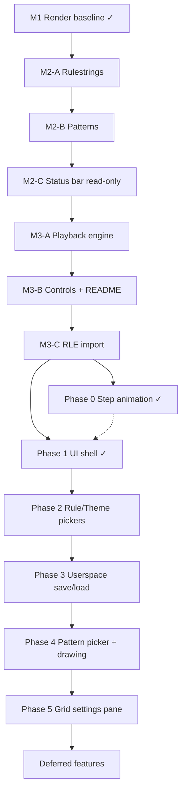
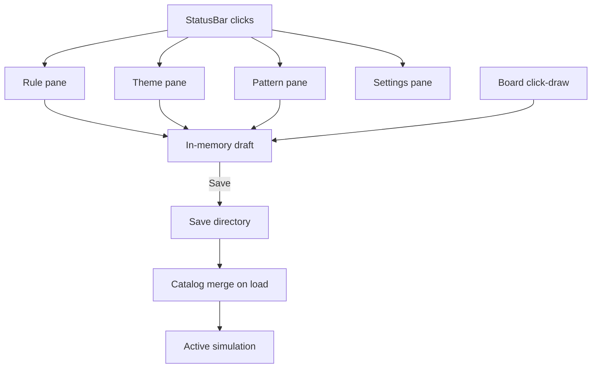
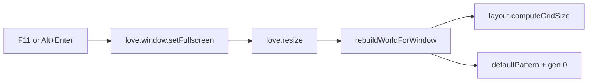

# PLAN

## Plan Status
- **Branch:** `main`
- **Version:** v1.1.0 tagged; Phase 1 ✓; Phase 2 not started
- **Done:** M1–M3, post-M3 polish, release CI, 1a fullscreen, **Phase 0**, **Phase 1** (UI shell)
- **Next:** Phase 2 rule/theme pickers → Phases 3–5
- Complete phases in order; each phase should leave the app runnable and tests green.

## Goal
Create a playable Conway's Game of Life in LÖVE: configurable toroidal grid, theme-driven rendering with next-generation preview markers, loadable initial patterns, configurable rulestrings, bottom status bar, and play/pause/step controls.

## Roadmap

| Milestone | Phases | Delivers |
|-----------|--------|----------|
| **M1** ✓ | — | Grid render, themes, preview dots, toroidal stepping foundation |
| **M2** | A → B → C | Configurable rules, pattern loader, status bar stats display |
| **M3** | A → B → C | Playback engine, controls/docs, RLE import |
| **Post-1.0** | 0 → 5 | Step animation, settings UI shell, pickers, userspace, board drawing, grid modes |
| **Deferred** | — | History stack, RLE export, import UI, video export |

## Execution Order

Phases are intentionally small. Finish each phase before starting the next.



### Milestone 1 — Render baseline ✓
- Configurable grid, themes, toroidal `next` preview, centered board in resizable window.
- `grid.seedGlider` inline demo until pattern loader lands (removed in M2-B).
- `grid.computeNext` hard-codes B3/S23 until M2-A.
- No playback UI (static preview only).

### Milestone 2-A — Rulestrings ✓
Pure Lua; no LÖVE changes required to finish this phase.

1. Add `src/rules.lua` — `parse(rulestring)`, presets `conway` / `ant_colony`, `get`, `list`
2. Add `tests/rules_spec.lua` — parser, presets, Ant Colony survives on 4 neighbors
3. Add `activeRule` to `src/config.lua` (default `"conway"`)
4. Refactor `grid.computeNext(world, rules)` and `grid.step(world, rules)` — replace hard-coded B3/S23
5. Update `tests/grid_spec.lua` to pass explicit Conway rules (keep behavior identical)

**Checkpoint:** `lua tests/run.lua` green; swapping `activeRule` to `ant_colony` changes simulation (config-only check until status bar).

### Milestone 2-B — Patterns ✓
1. Add `defaultPattern` to `src/config.lua` (default `"glider"`)
2. Add `patterns/glider.lua`, `patterns/blinker.lua`, `patterns/beacon.lua` (core catalog)
3. Add `src/patterns.lua` — `list`, `get`, `apply` (centered placement on world)
4. Wire `main.lua`: `patterns.apply(world, config.defaultPattern)` + `computeNext` with active rules
5. Remove `grid.seedGlider` (logic moves to `patterns/glider.lua`)

**Extended catalog** (same phase or immediately after core works):
- `patterns/pulsar.rle` (needs board ≥ 13×13; current 40×60 is fine)
- `patterns/random_soup.lua` (smoke test; good with `ant_colony`)

**Deferred catalog** (Future / when needed):
- `random_soup` — optional procedural seed for smoke tests

**Checkpoint:** `love .` loads glider (or other `defaultPattern`) from `patterns/`; no `seedGlider` in codebase.

### Milestone 2-C — Status bar (read-only) ✓
1. Add `stepInterval` to `src/config.lua` (default `0.15`; display only until M3)
2. Add `src/ui/statusbar.lua` — draw resolved rulestring, `rows×cols`, theme name, step interval
3. Wire `main.lua` `love.draw`: renderer above, status bar at bottom

**Checkpoint:** Bottom bar visible with live config values; board still centered above reserved area.

### Milestone 3-A — Playback engine ✓
1. Add `src/playback.lua` — `running`, `accumulator`, `play` / `pause` / `stepForward` wrapping `grid.step`
2. Wire `love.update` — auto-advance when `accumulator ≥ stepInterval`
3. Resolve active rules once in `love.load`; pass to `computeNext` / `step` / playback

**Checkpoint (M3-A, superseded by Phase 0):** play/pause/step advances generations; idle next-state markers while paused.

### Milestone 3-B — Status bar controls + docs ✓
1. Add play / pause / step buttons to `src/ui/statusbar.lua`
2. Wire mouse + keyboard shortcuts in `main.lua`
3. Update `README.md` — config keys, patterns, controls, rulestring presets

**Checkpoint:** Full playable app; README matches behavior.

### Milestone 3-C — RLE import ✓
1. Refactor `src/patterns.lua` with shared `stamp(world, pattern)` for all formats
2. Add `src/patterns/rle.lua` parser (`x/y/rule` header, run counts, `$`, `!`, comments)
3. Extend pattern resolution to load `patterns/<id>.rle` through `love.filesystem.read`
4. Add shipped `.rle` assets (`pulsar`, `gosper_glider_gun`, `lifeview`)
5. Add parser and integration tests (`tests/rle_spec.lua`, expanded `patterns_spec`)

**Checkpoint:** `lua tests/run.lua` green; existing Lua patterns still load; `.rle` patterns load by `defaultPattern` id.

### Post-M3 polish ✓
- **Auto-fit grid on load and resize** ✓ — `src/layout.lua` computes `rows`/`cols` from window size and `tileSize`; `love.load` and `love.resize` rebuild world and restart from `defaultPattern` (generation and playback reset).
- **Generation counter** ✓ — status bar shows `Gen: N`.
- **Fast mode** ✓ — hold `f` for `Play +` label and `0.05` step interval via `playback.setStepInterval`.
- **Restart control** ✓ — `r` key and status bar Restart button.
- **Deferred (superseded by Phase 5):** `Shift+Up`/`Shift+Down` tile-size hotkeys — grid settings pane replaces ad-hoc hotkeys.

### Post-1.0 Vision

Turn the status bar from a read-only stats row into the **primary control surface**: clickable labels open docked panes; a master **Settings** button covers grid/display options. Users can pick built-ins, edit drafts in memory, and **Save** custom patterns, rules, and themes to a shareable userspace folder.

**Generation step animation** (Phase 0 ✓): square preview → commit morph, idle next-state markers, pseudo-3D alive tiles.

**Fullscreen** (F11 / Alt+Enter) is folded into Phase 1 alongside the UI shell — keyboard-only, no status bar button.



#### Status bar UX (target layout)

**Left (clickable stat chips):**

| Chip | Opens |
|------|--------|
| `Rule: B3/S23` | Rule pane — preset list + custom `Bx/Sy` field + Apply / Save |
| `Theme: solarized` | Theme pane — preset list + color fields + Apply / Save |
| `Pattern: glider` | Pattern pane — catalog list + New / Edit / Save |
| `Size: 40x60` | Settings pane — grid section (or deep-link from master button) |
| `Gen: N` | Read-only (no pane) |

**Right:** existing Play / Pause / Step / Restart + new **Settings** button (grid, tile size, auto-fit toggle, fullscreen hint).

**Pane behavior:**
- Docked above the opener chip or button (left edges align; right-align on overflow).
- Full-window dim except the pane and active opener, which stay bright.
- One pane open at a time; clicking the same chip or `Esc` closes it.
- Theme-driven colors; reuse `src/ui/statusbar.lua` color helpers.

#### Draft vs saved state

New session object in `main.lua` (or `src/session.lua`):

| Field | Purpose |
|-------|---------|
| `draftRule` | Unsaved custom rulestring / preset selection |
| `draftTheme` | Unsaved color edits |
| `draftPattern` | Cells drawn or edited, not yet saved |
| `gridMode` | `"auto"` (default) or `"forced"` |
| `forcedTileSize`, `forcedRows`, `forcedCols` | Only used when `gridMode == "forced"` |

- **Apply** — use draft in simulation immediately (recompute preview; optional restart policy per pane).
- **Save** — write to userspace; assign stable `id` (slug from name).
- **Discard** — revert draft to last applied/saved state.

Board drawing writes to `draftPattern` / live `world.current` while paused (never while playing).

#### Userspace persistence

All user-created assets live under the LÖVE save directory (shareable, outside the `.love` bundle):

```
<saveDirectory>/
  patterns/<id>.lua      # { id, name, cells = {{col,row}, ...} }
  rules/<id>.lua         # { id, name, rulestring = "B3/S23" }
  themes/<id>.lua        # { name, alive, dead, grid, background } hex strings
```

New module: `src/userdata.lua`
- `getBasePath()` → `love.filesystem.getSaveDirectory() .. "/..."`
- `list(type)`, `load(type, id)`, `save(type, id, data)`, `delete(type, id)`
- Pure-Lua serialization helpers (testable without LÖVE) + thin `love.filesystem` IO wrapper

**Catalog merge:** extend `src/patterns.lua`, `src/rules.lua`, `src/themes.lua`:
- Built-ins first, then user entries from save dir
- `list()` returns merged ids; `get(id)` checks built-in → bundled RLE → user file

#### Input and interaction rules

- Panes capture mouse/keyboard while open (typing in rule field must not trigger play shortcuts).
- `Esc` closes top pane.
- Drawing/editing requires **paused** playback.
- Resize restart policy:
  - **Auto mode:** keep current restart-on-resize behavior.
  - **Forced mode:** resize only recenters; changing grid fields restarts from active pattern/draft.

#### Recommended implementation order

Phase 0 ✓ and 1a fullscreen ✓ are complete on `main`. Phase 1 ✓. **Start Phase 2 next.**

| Step | Phase | Rationale |
|------|-------|-----------|
| 1 | **1a — Fullscreen** ✓ | F11 / Alt+Enter; shipped on `main` |
| 2 | **0 — Step animation** ✓ | Square preview→commit, idle markers, 3D tiles; PR #1 |
| 3 | **1 — UI shell + `session.lua`** ✓ | Pane framework, clickable chips; placeholder panes |
| 4 | **2 — Rule + theme pickers** | Apply-only first; validates pane UX without disk I/O; **next** |
| 5 | **3a — `userdata.lua`** | Persistence API + catalog merge + unit tests |
| 6 | **3b — Save UI** | Save / Delete on rule + theme panes |
| 7 | **4a — Pattern picker** | Catalog list + Load (no drawing yet) |
| 8 | **4b — Board drawing** | Click-to-draw + draft + Save (needs idle animation + input routing) |
| 9 | **5 — Grid settings** | Auto vs forced letterbox last; changes global resize policy |

**Suggested release slices:**

| Release | Contents |
|---------|----------|
| v1.1 | Fullscreen (1a) + Phase 0 animation (square preview→commit, 3D tiles) — **ready to tag** |
| v1.2 | Phase 1 shell + Phase 2 pickers (Apply only) |
| v1.3 | Phase 3 persistence + Phase 4a pattern picker |
| v1.4 | Phase 4b board drawing + Phase 5 grid settings |

**Defer until stable:** history stack (needs Phase 0 commit model), RLE export for user patterns, import file picker UI.

---

### Phase 0 — Generation step animation ✓

Shipped on `main` (PR #1). No further Phase 0 work unless explicitly requested.

#### Problem (pre-Phase 0)

`src/renderer.lua` draws **current** tiles and **preview dots** for cells where `current ~= next` at the same time. `src/playback.lua` calls `grid.step` immediately, swapping buffers with no visual transition.

#### Shipped behavior (Phase 0 ✓)

Two-phase morph per generation step (`stepAnimPreviewSec` + `stepAnimCommitSec`). **Idle:** `current` on pseudo-3D tiles plus tiny square next-state markers where `current ~= next`. **Step/play:**

- **Preview:** marker eases in on changing cells (alive dot on dead tile = birth; dead dot on alive tile = death).
- **Commit:** square grows to full alive face or dead square consumes the alive face.
- Morph completes → `grid.step` + `grid.computeNext`.

Alive cells use extruded top faces (`tileDepthAlivePx`); dead cells can stay flat (`tileDepthDeadPx = 0`). Fast mode (`f` hold) scales morph speed and step interval. `stepAnimEnabled = false` commits immediately.

#### Historical design notes (superseded)

Early iterations: static preview dots, circle morph, two-phase circle morph, multi-generation death trail. Shipped design: **square** preview → commit with idle next-state markers and pseudo-3D alive tiles.

#### Files (Phase 0 ✓)

| File | Role |
|------|------|
| `src/step_animation.lua` | Preview → commit timer; `getPhaseT`, `getCellChange` |
| `src/renderer.lua` | Square morph, idle preview markers, extruded tiles |
| `main.lua` | Defer `grid.step` until morph completes |
| `tests/step_animation_spec.lua` | Phase timing and cell-change detection |

**Checkpoint:** Idle shows current + next markers; step morphs squares; pseudo-3D alive tiles; fast mode works; tests green.

---

### Phase 1 — UI shell + fullscreen ✓

**Delivers:** pane framework, clickable status bar regions, Settings button, fullscreen keys.

| File | Role |
|------|------|
| `src/ui/pane.lua` | Pane manager: open/close/toggle, draw, hit-test, height |
| `src/ui/statusbar.lua` | Clickable stat chips; Settings button |
| `src/session.lua` | Draft/applied state scaffold for Phases 2–5 |
| `main.lua` | Input routing; `Esc` closes pane |
| `src/renderer.lua` | Board layout unchanged when pane open |
| `tests/pane_spec.lua` | Pane open/close/toggle and hit-test |

#### Fullscreen toggle

Keyboard-only fullscreen toggle:
- **F11** — toggle on/off
- **Alt+Enter** — toggle on/off (check `return` key with Alt held)

No status bar UI button (Settings pane may show a hint).



Toggle helper in `main.lua`:

```lua
local function toggleFullscreen()
  local fullscreen, fstype = love.window.getFullscreen()
  love.window.setFullscreen(not fullscreen, fstype or "desktop")
end
```

Use `"desktop"` fullscreen mode (borderless desktop resolution; works well with resizable/auto-fit grid).

**Tradeoff (unchanged):** toggling fullscreen restarts the simulation, same as manual window resize. On macOS, Option+Return may not map to Alt+Enter; F11 remains the primary cross-platform shortcut.

No `conf.lua` change required — `resizable = true` already set.

**Checkpoint:** ✓ Docked pane + dim spotlight on opener; chips/Settings/×/`Esc` open and close; playback keys blocked while open.

---

### Phase 2 — Runtime rule and theme pickers

**Delivers:** click Rule / Theme chips → working panes with built-in lists.

| File | Work |
|------|------|
| `src/ui/panes/rule_pane.lua` | Preset buttons, `Bx/Sy` text input, Apply |
| `src/ui/panes/theme_pane.lua` | Preset buttons, hex color fields, Apply |
| `main.lua` | Swap `activeRule` / `theme` on Apply; `grid.computeNext` |

**Checkpoint:** switch conway ↔ ant_colony and themes without editing config file.

---

### Phase 3 — Userspace save/load for rules and themes

**Delivers:** Save custom rule/theme to save directory; merged catalogs.

| File | Work |
|------|------|
| `src/userdata.lua` | IO + serialization |
| `src/rules.lua` / `src/themes.lua` | Load user presets |
| Rule/Theme panes | Save / Delete buttons, name field |
| `tests/userdata_spec.lua` | Round-trip serialize tests |

**Checkpoint:** create custom theme, quit, relaunch, still listed.

---

### Phase 4 — Pattern picker + board drawing

**Delivers:** pattern selection, click-to-draw starting state, draft pattern memory.

| File | Work |
|------|------|
| `src/ui/panes/pattern_pane.lua` | Catalog list, Load, New (clear + draw mode) |
| `src/input/board.lua` | `screenToCell` + toggle |
| `src/patterns.lua` | `fromWorld`, `list` merge user patterns |
| Pattern pane | Save to userspace as `.lua` |

Board drawing (`src/input/board.lua`):
- `screenToCell(x, y, layout)` — inverse of `src/renderer.lua` layout math
- `toggleCell(world, row, col)` on left-click when pane closed or "draw mode" active
- Only when `playback` paused and no pane consuming clicks

Pattern export: `patterns.fromWorld(world)` → `{ cells = {{col,row}, ...} }` for draft/save.

**Phase 4a scope:** flat catalog list (built-in + user). **Deferred follow-up:** group patterns by **type** in the picker UI (see Deferred).

**Checkpoint:** draw shape on board, save as `my_pattern`, reload from list.

---

#### Pattern type grouping (deferred — post Phase 4)

When the catalog grows — especially if loading from a **public RLE repository** — the pattern pane should group entries by **LifeWiki-style category**, not only a flat id list.

**Proposed categories (initial set):**

| Category | Examples |
|----------|----------|
| Still lifes | block, beehive, loaf |
| Oscillators | blinker, beacon, pulsar |
| Spaceships | glider, lwss |
| Linear growth | puffer, rake, gun |
| Methuselahs | diehard, r-pentomino |
| Other / uncategorized | fallback when type unknown |

**Data model (future):**
- Extend pattern metadata: `{ id, name, cells, category?, period?, tags? }`
- Built-in Lua/RLE: optional `category` field in module table or RLE comment header (e.g. `#C category: oscillator`)
- External repo import: map filename, sidecar `.json`, or community index to `category`
- `patterns.listByCategory()` or `patterns.listGrouped()` for pane UI (collapsible sections)

**UI (future):** Pattern pane shows category headers with scrollable sub-lists; search/filter across all types. User-saved patterns default to `Other` or user-assigned type on Save.

**Not in Phase 4 MVP** — ship flat list first; add grouping when catalog size or external RLE sync justifies it.

---

### Phase 5 — Grid settings pane (auto vs forced)

**Delivers:** Settings pane for tile size, rows, cols, auto-fit toggle.

Extend `src/layout.lua`:

```lua
-- auto: current behavior
computeGridSize(windowW, windowH, tileSize, statusBarHeight)

-- forced: user values; letterbox in viewport
computeBoardLayout(windowW, windowH, rows, cols, tileSize, statusBarHeight, paneHeight)
-- returns offsetX, offsetY (centered), same as renderer today
```

**Auto mode:** window resize → recompute rows/cols from `tileSize` (current `main.lua` `rebuildWorldForWindow`).

**Forced mode:** resize only recenters/letterboxes; **does not** change rows/cols/tileSize. Changing forced values in Settings pane rebuilds grid (restart from selected pattern or current draft).

Config additions in `src/config.lua`: `gridMode`, `forcedRows`, `forcedCols`, `forcedTileSize` (defaults mirror current hints).

| File | Work |
|------|------|
| `src/ui/panes/settings_pane.lua` | Auto/forced toggle, numeric fields, Apply |
| `src/layout.lua` | Forced layout path; letterbox centering |
| `main.lua` | Split `rebuildWorldForWindow` vs `applyGridSettings` |

**Checkpoint:** force 80×80 @ 8px tile, letterboxed; toggle back to auto-fit on resize.

---

### Post-1.0 testing strategy

| Layer | Approach |
|-------|----------|
| `step_animation` phase machine + lerp | Pure Lua unit tests |
| `userdata` serialize/parse | Pure Lua unit tests |
| `layout` forced letterbox math | Extend `tests/layout_spec.lua` |
| `patterns.fromWorld` | Unit test |
| Pane hit regions | Extend `tests/statusbar_spec.lua` with mock geometry |
| Full UI | Manual smoke per phase |
| Fullscreen | Manual smoke — F11 toggle, grid auto-fit, playback after exit (no unit tests; `love.window` is LÖVE-only) |

---

### Explicitly deferred (post-1.0 roadmap)

- Static preview dots (replaced by step animation in Phase 0)
- RLE export for user patterns (start with `.lua`; RLE export later)
- Import/share UI (file picker) — users can copy files manually from save dir
- Step backward / history stack (`grid.clone`)
- Video export (gif/mp4 or equivalent)
- Custom app icon / code signing
- Tile-size hotkeys (`Shift+Up`/`Shift+Down`) — superseded by Phase 5 settings pane
- More built-in rule presets and themes (users can save custom via Phase 3)

### Future backlog (superseded by post-1.0 phases)

The items below remain tracked for history; implementation is covered by Phases 0–5 unless noted as deferred above.

- ~~Step backward via generation **history stack**~~ — **deferred** (needs `grid.clone` / snapshot helper)
- ~~Click-to-toggle cells~~ — **Phase 4** (board drawing)
- ~~Pattern picker UI (cycle/load catalog at runtime)~~ — **Phase 4**
- ~~Runtime rule / theme switching (keyboard/UI picker)~~ — **Phases 2–3**
- ~~More built-in rule presets and themes~~ — **Phase 3** userspace + optional built-in expansion
- ~~Video export (gif/mp4 or equivalent)~~ — **deferred**

## Planned Files

| File | Status | Phase |
|------|--------|-------|
| `main.lua` | exists | M2-B wire patterns; M2-C status bar; M3 playback |
| `conf.lua` | exists | — |
| `src/config.lua` | exists | M2-A `activeRule`; M2-B `defaultPattern`; M2-C `stepInterval` |
| `src/themes.lua` | exists | — |
| `src/grid.lua` | exists | M2-A ✓ rules param; M2-B ✓ removed `seedGlider` |
| `src/renderer.lua` | exists | — |
| `src/rules.lua` | exists | M2-A ✓ |
| `src/patterns.lua` | exists | M2-B ✓; M3-C ✓ shared stamp + RLE resolution |
| `src/patterns/rle.lua` | exists | M3-C ✓ |
| `patterns/*.lua` | exists (core) | M2-B ✓ |
| `patterns/*.rle` | exists (`pulsar`, `gosper_glider_gun`, `lifeview`) | M3-C ✓ |
| `src/ui/statusbar.lua` | exists | M2-C ✓ display; M3-B controls |
| `src/playback.lua` | exists | M3-A ✓ |
| `src/layout.lua` | exists | Post-M3 ✓ auto-fit sizing |
| `src/util.lua` | exists | Post-M3 ✓ shared `wrap` helper |
| `tests/grid_spec.lua` | exists | M2-A update for rules param |
| `tests/rules_spec.lua` | exists | M2-A ✓ |
| `tests/patterns_spec.lua` | exists | M2-B ✓; M3-C ✓ RLE load path |
| `tests/rle_spec.lua` | exists | M3-C ✓ |
| `tests/layout_spec.lua` | exists | Post-M3 ✓ resize math |
| `tests/playback_spec.lua` | exists | M3-A ✓ |
| `tests/statusbar_spec.lua` | exists | Post-M3 ✓ layout/hit-test; Phase 1+ pane hit regions |
| `tests/run.lua` | exists | M2-A/B + M3-C register specs |
| `src/step_animation.lua` | planned | Phase 0 ✓ |
| `tests/step_animation_spec.lua` | planned | Phase 0 ✓ |
| `src/ui/pane.lua` | planned | Phase 1 ✓ |
| `src/ui/panes/rule_pane.lua` | planned | Phase 2 ✓ |
| `src/ui/panes/theme_pane.lua` | planned | Phase 2 ✓ |
| `src/ui/panes/pattern_pane.lua` | planned | Phase 4 ✓ |
| `src/ui/panes/settings_pane.lua` | planned | Phase 5 ✓ |
| `src/userdata.lua` | planned | Phase 3 ✓ |
| `tests/userdata_spec.lua` | planned | Phase 3 ✓ |
| `src/input/board.lua` | planned | Phase 4 ✓ |
| `src/session.lua` | exists | Phase 1 ✓ draft/applied scaffold |
| `.github/workflows/test.yml` | exists | CI — Lua 5.4, `lua tests/run.lua` on push/PR |
| `.github/workflows/release.yml` | exists | v1.0 — tag-triggered build + GitHub Release |

## Design Decisions (locked before implementation)

### Board boundaries
- **Toroidal wrap**: the grid edges connect; out-of-bounds neighbors wrap around (left↔right, top↔bottom).
- Neighbor lookup in `grid.lua` must use modular arithmetic on row/col indices.

### Window layout
- **Resizable window** with the board **centered** in the viewport above the status bar.
- **Auto-fit grid:** at load and on every resize, `rows` and `cols` are recomputed as `floor(viewport / tileSize)` (minimum `1×1`), where viewport height excludes `statusBarHeight`.
- Board pixel size = `cols * tileSize` × `rows * tileSize`.
- Renderer computes board offset from `love.graphics.getDimensions()` so centering survives resize.
- **Resize restarts simulation:** rebuild world, reapply `defaultPattern`, reset generation and playback (tradeoff: no cell-state preservation on resize).

### Coordinate conventions
- **1-based** row/col indexing in Lua tables (idiomatic Lua).
- Screen mapping: `col` → x, `row` → y; origin top-left (matches LÖVE).
- Mouse-to-cell conversion (future input) uses the same offset math as renderer.

### Grid data model
- Prefer a small **world** object bundling:
  - `rows`, `cols`
  - `current` (2D boolean table)
  - `next` (2D boolean table, same dimensions)
- Keeps dimensions and buffers together for step/preview/render.
- `grid.clone(world)` — **deferred** to history-stack work (Future); not required for M2–M3.

### Grid line rendering
- Draw filled cell rects first, then grid lines on top.
- Use half-pixel alignment (`+ 0.5`) where needed for crisp 1px lines on integer tile sizes.

### Demo seed / initial patterns
- **Milestone 1**: `grid.seedGlider` inline demo (temporary).
- **Milestone 2-B**: repo files under `patterns/`; remove `seedGlider`.
- Patterns are placed **centered** on the current board (toroidal wrap applies after placement).

#### Pattern file format (repo-native Lua)
- One file per pattern: `patterns/<id>.lua`
- Returns a table:
```lua
return {
  id = "glider",
  name = "Glider",
  -- cells as {col, row} offsets from pattern origin (0-based deltas)
  cells = {
    { 1, 0 }, { 2, 1 }, { 0, 2 }, { 1, 2 }, { 2, 2 },
  },
}
```
- `src/patterns.lua`:
  - `list()` — discover/load catalog entries
  - `get(id)` — load one pattern
  - `apply(world, patternId)` — clear world, stamp pattern centered on board

#### Pattern catalog tiers
| Tier | Patterns | When |
|------|----------|------|
| Core (M2-B) | `glider`, `blinker`, `beacon` | Required for phase complete |
| Extended (M3-C) | `pulsar.rle`, `gosper_glider_gun.rle`, `lifeview.rle`, plus spaceships (`copperhead`, `fireship`, `loafer`, `sidecar`), guns/rakes (`backrake_1`, `bomber`, `circle_of_fire`), methuselahs (`cottonmouth`, `moose_antlers`, `noahs_ark`, `diamond`), hybrids (`pulsar_on_pentadecathlon_i`, `still_life_tagalong`) | Loaded via RLE parser |
| Deferred (Future) | `random_soup` | Optional procedural seed |

#### RLE import (M3-C implementation)
- Supports standard Life **RLE** (`.rle`) for shipped and community patterns.
- Parser lives in `src/patterns/rle.lua` and returns normalized `{ id, name, rulestring, cells }`.
- `src/patterns.lua` resolves ids in order: Lua module → `.rle` file → fallback `glider`.
- RLE `rule = ...` is parsed and exposed, but simulation rule selection still uses config `activeRule`.
- Deferred RLE features:
  - honoring `#P` offsets
  - multiple patterns per file
  - runtime file picker / import UI
  - **pattern type metadata** and grouped picker UI (still lifes, oscillators, spaceships, linear growth, etc.) — see Phase 4 deferred follow-up
  - sync from a **public RLE pattern repository** (community catalog + category index)

### Status bar (bottom)
- Fixed-height bar at **bottom** of window (`statusBarHeight` in config, not in theme).
- Board renders in remaining viewport above the bar (still centered horizontally).
- **Milestone 2-C** (display only): show
  - resolved rulestring (e.g. `B3/S23`)
  - board size (`rows×cols`)
  - active theme name
  - generation counter (`Gen: N`) — replaced planned step-interval display
- **Milestone 3-B** (interactive): add controls
  - Play / Pause
  - Step forward (advance one generation)
  - Restart (reload `defaultPattern`, reset generation)
- **Post-M3:** fast mode (`f` hold) changes Play label to `Play +` and step interval to `0.05`
- Text/button hit areas in `src/ui/statusbar.lua`; input wired in `main.lua`.

### Playback (Milestone 3)
- State: `running` (bool), `stepInterval` (seconds), `accumulator` (dt).
- **Play**: set `running = true`; `love.update` advances when accumulator ≥ `stepInterval`.
- **Pause**: set `running = false`.
- **Step forward**: single generation regardless of `running` — delegates to `grid.step(world, rules)` (v1.0: immediate; **Phase 0**: deferred until animation completes).
- While idle/paused, board shows **current** plus tiny square next-state markers; morph runs on step/play (**Phase 0** ✓).
- History push on forward step — **deferred** to Future history stack.

### Step backward (future — history stack)
- **Deferred** for Milestone 1–M3.
- Plan: ring buffer or stack of `current` grid snapshots per forward step.
- Requires `grid.clone(world)` helper.
- Step back pops history → restore `current` → recompute `next`.
- Memory cost: `O(historyDepth × rows × cols)`; cap depth in config later.

### Rule engine and rulestrings (Milestone 2-A)
- Life **rulestrings** have the form `Bx/Sy`:
  - `B` digits = neighbor counts that **birth** a dead cell (exact match).
  - `S` digits = neighbor counts that let a **live** cell survive (exact match).
  - Any other neighbor count kills a live cell or leaves a dead cell dead.
- Example: `B3/S23` (classic Conway) — a dead cell with exactly 3 live neighbors is born; a live cell with exactly 2 or 3 live neighbors survives.
- Example: `B3/S234` (**Ant Colony**) — same birth rule; live cells survive on 2, 3, or 4 neighbors.
- Named presets (like themes), selected by `activeRule` in config.
- Built-in presets:

| name | rulestring | notes |
|------|------------|-------|
| `conway` | `B3/S23` | classic Conway's Game of Life (default) |
| `ant_colony` | `B3/S234` | Ant Colony Life — expanding edges, settling center |

- Status bar displays the resolved rulestring (e.g. `B3/S23`), not the preset id.

## Design Outline

### Themes (named color schemes)
- A theme is a named table of **colors only** — no sizes, spacing, or layout.
- Themes are registered in `src/themes.lua` and selected by name from config.
- Baseline ships three built-in themes: `classic`, `zenburn`, `solarized`.
- Renderer and preview markers read all draw colors from the active theme.

#### Built-in themes
| name | alive | dead | grid | background |
|------|-------|------|------|------------|
| `classic` | white `#FFFFFF` | black `#000000` | gray `#808080` | `#000000` (same as dead) |
| `zenburn` | `#DCDCCC` | `#3F3F3F` | white `#FFFFFF` | `#3F3F3F` (same as dead) |
| `solarized` | `#fdf6e3` | `#002b36` | `#073642` | `#002b36` (same as dead) |

#### `src/themes.lua`
- Export: `themes`, `get(name)`, `list()`

### `src/config.lua`
- Central constants:

| Key | Default | Phase |
|-----|---------|-------|
| `rows` | `40` | M1 ✓ |
| `cols` | `60` | M1 ✓ |
| `tileSize` | `24` | M1 ✓ |
| `activeTheme` | `"classic"` | M1 ✓ |
| `statusBarHeight` | `28` | M1 ✓ |
| `stepAnimPreviewSec` | `0.08` | Phase 0 ✓ |
| `stepAnimCommitSec` | `0.12` | Phase 0 ✓ |
| `stepAnimEnabled` | `true` | Phase 0 ✓ |
| `previewDotScale` | `0.15` | Phase 0 ✓ |
| `previewDotMinPx` | `4` | Phase 0 ✓ |
| `tileDepthAlivePx` | `3` | Phase 0 ✓ |
| `tileDepthDeadPx` | `0` | Phase 0 ✓ |
| `gridMode` | `"auto"` | Phase 5 |
| `forcedRows`, `forcedCols`, `forcedTileSize` | mirror hints | Phase 5 |
| `activeRule` | `"conway"` | M2-A ✓ |
| `defaultPattern` | `"glider"` | M2-B ✓ |
| `stepInterval` | `0.10` | M2-C ✓ (display removed in post-M3; used by playback) |

### `src/rules.lua` (M2-A)
- Export:
  - `rules` — map of name → `{ name, rulestring, birth, survival }`
  - `get(name)` — resolve preset (fallback to `conway`)
  - `parse(rulestring)` — `Bx/Sy` → birth/survival sets
  - `list()` — optional, for future UI rule picker
- Shipped presets: `conway` (`B3/S23`), `ant_colony` (`B3/S234`).

### `src/grid.lua`
- Expose helpers:
  - `create(rows, cols)`
  - `clear(world)`, `setAlive(world, row, col, alive)`
  - `countNeighbors(world, row, col)`
  - `computeNext(world, rules)`
  - `step(world, rules)`
  - `isAlive(world, row, col)`

### `src/renderer.lua`
- Accept active theme + size config + layout (board area excludes status bar).
- Compute board offset: centered in viewport **above** status bar.
- Draw extruded alive tiles, idle next-state square markers, step morph squares, grid lines.

### `main.lua`
- `love.load`: world, theme, rules, pattern, initial `computeNext`
- `love.update` (M3-A): playback timer when running
- `love.draw`: clear, board, status bar (M2-C+)
- `love.keypressed` / mouse (M3-B): play/pause/step

### `conf.lua`
- Resizable window; initial size from board + status bar reserve + margin.

## CI

### Tests
- Workflow: `.github/workflows/test.yml`
- Trigger: push to `main`, all pull requests
- Runner: `ubuntu-latest`, Lua 5.4 via `leafo/gh-actions-lua`
- Command: `lua tests/run.lua`

### Release
- Workflow: `.github/workflows/release.yml`
- Trigger: push tag `v*` (e.g. `v1.0.0`)
- Steps: run tests → stage game files (`main.lua`, `conf.lua`, `src/`, `patterns/`, `LICENSE`) → [nhartland/love-build](https://github.com/marketplace/actions/love-build) (LÖVE 11.5) → [softprops/action-gh-release](https://github.com/softprops/action-gh-release)
- Artifacts: `love-life.love`, Windows 32/64 zips, macOS `.app` zip, Linux x86_64 AppImage zip

## Validation

### Always
- `lua tests/run.lua` — grid + rules + patterns unit tests (no LÖVE)
- `love .` — visual smoke test

### Per phase
| Phase | Verify |
|-------|--------|
| M2-A | Tests green; `activeRule = "ant_colony"` changes survival (e.g. 4 neighbors) |
| M2-B | `defaultPattern` loads from `patterns/`; `seedGlider` removed |
| M2-C | Status bar shows rulestring, size, theme, generation |
| M3-A | Generations advance on timer / step; idle next-state markers while paused |
| M3-B | Bar buttons + keys work; README accurate |
| Phase 0 ✓ | Square preview→commit morph; idle next-state markers; pseudo-3D alive tiles; tests green |
| Phase 1 ✓ | Panes open/close; clickable chips; Settings button |
| Phase 2 | Switch rules/themes via panes without config edit |
| Phase 3 | Custom theme persists across relaunch |
| Phase 4 | Draw pattern, save, reload from list |
| Phase 5 | Forced grid letterboxed; auto-fit on toggle back |

## Open Design Considerations
- Pattern discovery strategy: keep `patterns.list()` as explicit curated ids, or move to dynamic directory discovery when catalog grows.
- Pattern fallback UX: current loader falls back silently to `glider`; decide whether to log/warn in-app for unknown `defaultPattern`.
- Status bar text scaling: long strings can clip on small windows; decide whether to truncate, reduce font size, or wrap.
- Playback timer semantics: fast mode already changes `stepInterval` at runtime via `playback.setStepInterval` while held; decide if other runtime interval changes should reset accumulator.
- Theme contrast policy: status bar currently uses theme colors directly; decide if accessibility overrides are needed for low-contrast themes.
- **LÖVE 12 (when released):** Revisit `Font:setBold()` for pane titles (11.x uses larger font only); evaluate CI/release bump from 11.5.

### M1 visual checklist (regression)
- Expected rows/cols, aligned grid lines, theme colors; step morph on birth/death cells only (Phase 0)

## TODO Tracking

### Milestone 1 ✓
- [x] Create minimal LÖVE entry files and module layout (`main.lua`, `conf.lua`, `src/*`)
- [x] Add `src/themes.lua` with named theme registry (`classic`, `zenburn`, `solarized`)
- [x] Implement world/grid model with toroidal B3/S23 `computeNext`
- [x] Render theme-driven fills, preview center dots, and grid lines (centered above status bar area)
- [x] Wire load/draw lifecycle and resizable window defaults
- [x] Add plain Lua unit tests for `src/grid.lua` (`tests/run.lua`)

### Milestone 2-A — Rulestrings ✓
- [x] Add `src/rules.lua` — `Bx/Sy` parser and presets (`conway`, `ant_colony`)
- [x] Add `tests/rules_spec.lua`; register in `tests/run.lua`
- [x] Add `activeRule` to `src/config.lua`
- [x] Refactor `grid.computeNext(world, rules)` and `grid.step(world, rules)`
- [x] Update `tests/grid_spec.lua` for explicit rules argument

### Milestone 2-B — Patterns ✓
- [x] Add `defaultPattern` to `src/config.lua`
- [x] Add core `patterns/*.lua` (`glider`, `blinker`, `beacon`)
- [x] Add `src/patterns.lua` loader (`list`, `get`, `apply`)
- [x] Wire `main.lua` to load `defaultPattern` with active rules
- [x] Remove `grid.seedGlider`
- [x] Add extended pattern `pulsar` (via RLE in M3-C)
- [ ] Add `random_soup` — optional procedural seed

### Milestone 2-C — Status bar (read-only) ✓
- [x] Add `stepInterval` to `src/config.lua`
- [x] Add `src/ui/statusbar.lua` (display-only stats row)
- [x] Wire status bar in `main.lua` `love.draw`

### Milestone 3-A — Playback engine ✓
- [x] Add `src/playback.lua` — play/pause/step-forward state machine
- [x] Wire `stepInterval` auto-advance in `love.update`
- [x] Pass resolved rules through playback → `grid.step`

### Milestone 3-B — Controls + docs ✓
- [x] Status bar play/pause/step buttons and keyboard shortcuts
- [x] Update `README.md` (config, patterns, controls, rulestrings)

### Milestone 3-C — RLE import ✓
- [x] Extract shared `patterns.stamp(world, pattern)` and keep Lua pattern path intact
- [x] Add `src/patterns/rle.lua` parser and `tests/rle_spec.lua`
- [x] Extend `patterns.get` to resolve `patterns/<id>.rle` via `love.filesystem.read`
- [x] Add shipped `patterns/pulsar.rle`, `patterns/gosper_glider_gun.rle`, and `patterns/lifeview.rle`
- [x] Extend tests for RLE loading path and register RLE spec in `tests/run.lua`

## Next Features (Do Not Delete, Mark Complete Later)

### Post-1.0 phased roadmap (Phases 0–5)
- [x] **Phase 0** — Generation step animation (`src/step_animation.lua`; defer `grid.step`)
- [ ] **Phase 1** — UI shell (pane manager, clickable chips, Settings button; fullscreen keys done in 1a)
- [ ] **Phase 2** — Rule and theme pickers (docked panes, built-in Apply)
- [ ] **Phase 3** — Userspace save/load (`src/userdata.lua`; merged catalogs)
- [ ] **Phase 4** — Pattern picker + board drawing (draft patterns, click-to-draw)
- [ ] **Phase 5** — Grid settings pane (auto vs forced, letterbox)

### Deferred (not in Phases 0–5)
- [ ] Step backward via generation history stack (`grid.clone`)
- [ ] RLE export for user patterns
- [ ] Import/share UI (file picker)
- [ ] **Pattern catalog grouping by type** (still lifes, oscillators, spaceships, linear growth, methuselahs, etc.) for pattern pane UI
- [ ] **External RLE repository sync** — consume a public pattern repo; category metadata drives grouped picker
- [ ] Add export feature (gif/mp4 or equivalent)
- [ ] Add `random_soup` — optional procedural seed

### Superseded by post-1.0 phases (mark complete when phase ships)
- [ ] Add click-to-toggle cell state → **Phase 4**
- [ ] Pattern picker UI (cycle/load catalog entries at runtime) → **Phase 4**
- [ ] Add runtime rule switching (keyboard/UI picker) → **Phases 2–3**
- [ ] Add runtime theme switching (keyboard/UI picker) → **Phases 2–3**
- [ ] Add more built-in rule presets beyond `conway`, `ant_colony` → **Phase 3** userspace
- [ ] Add more built-in themes beyond `classic`, `zenburn`, `solarized` → **Phase 3** userspace
- [x] Add `gosper_glider_gun` pattern (RLE, M3-C)
