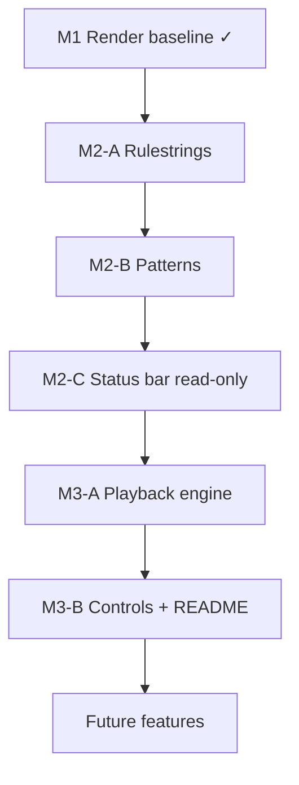

# PLAN

## Plan Status
- **Branch:** `main`
- **Done:** Milestone 1 (render baseline + grid tests)
- **Next:** Milestone 2-A — rulestrings (`src/rules.lua`, wire `grid.computeNext`)
- Complete phases in order; each phase should leave the app runnable and tests green.

## Goal
Create a playable Conway's Game of Life in LÖVE: configurable toroidal grid, theme-driven rendering with next-generation preview markers, loadable initial patterns, configurable rulestrings, bottom status bar, and play/pause/step controls.

## Roadmap

| Milestone | Phases | Delivers |
|-----------|--------|----------|
| **M1** ✓ | — | Grid render, themes, preview dots, toroidal B3/S23 (hard-coded), glider seed |
| **M2** | A → B → C | Configurable rules, pattern loader, read-only status bar |
| **M3** | A → B | Playback engine, interactive status bar, README controls |
| **Future** | — | RLE, history stack, cell editing, runtime pickers, export |

## Execution Order

Phases are intentionally small. Finish each phase before starting the next.



### Milestone 1 — Render baseline ✓
- Configurable grid, themes, toroidal `next` preview, centered board in resizable window.
- `grid.seedGlider` inline demo until pattern loader lands (removed in M2-B).
- `grid.computeNext` hard-codes B3/S23 until M2-A.
- No playback UI (static preview only).

### Milestone 2-A — Rulestrings
Pure Lua; no LÖVE changes required to finish this phase.

1. Add `src/rules.lua` — `parse(rulestring)`, presets `conway` / `ant_colony`, `get`, `list`
2. Add `tests/rules_spec.lua` — parser, presets, Ant Colony survives on 4 neighbors
3. Add `activeRule` to `src/config.lua` (default `"conway"`)
4. Refactor `grid.computeNext(world, rules)` and `grid.step(world, rules)` — replace hard-coded B3/S23
5. Update `tests/grid_spec.lua` to pass explicit Conway rules (keep behavior identical)

**Checkpoint:** `lua tests/run.lua` green; swapping `activeRule` to `ant_colony` changes simulation (config-only check until status bar).

### Milestone 2-B — Patterns
1. Add `defaultPattern` to `src/config.lua` (default `"glider"`)
2. Add `patterns/glider.lua`, `patterns/blinker.lua`, `patterns/beacon.lua` (core catalog)
3. Add `src/patterns.lua` — `list`, `get`, `apply` (centered placement on world)
4. Wire `main.lua`: `patterns.apply(world, config.defaultPattern)` + `computeNext` with active rules
5. Remove `grid.seedGlider` (logic moves to `patterns/glider.lua`)

**Extended catalog** (same phase or immediately after core works):
- `patterns/pulsar.lua` (needs board ≥ 13×13; current 40×60 is fine)
- `patterns/random_soup.lua` (smoke test; good with `ant_colony`)

**Deferred catalog** (Future / when needed):
- `gosper_glider_gun` — large; add when board sizing story is settled

**Checkpoint:** `love .` loads glider (or other `defaultPattern`) from `patterns/`; no `seedGlider` in codebase.

### Milestone 2-C — Status bar (read-only)
1. Add `stepInterval` to `src/config.lua` (default `0.15`; display only until M3)
2. Add `src/ui/statusbar.lua` — draw resolved rulestring, `rows×cols`, theme name, step interval
3. Wire `main.lua` `love.draw`: renderer above, status bar at bottom

**Checkpoint:** Bottom bar visible with live config values; board still centered above reserved area.

### Milestone 3-A — Playback engine
1. Add `src/playback.lua` — `running`, `accumulator`, `play` / `pause` / `stepForward` wrapping `grid.step`
2. Wire `love.update` — auto-advance when `accumulator ≥ stepInterval`
3. Resolve active rules once in `love.load`; pass to `computeNext` / `step` / playback

**Checkpoint:** Keyboard-only smoke test (temporary keys in `main.lua` or love.conf) — play/pause/step advances generations; preview dots update while paused.

### Milestone 3-B — Status bar controls + docs
1. Add play / pause / step buttons to `src/ui/statusbar.lua`
2. Wire mouse + keyboard shortcuts in `main.lua`
3. Update `README.md` — config keys, patterns, controls, rulestring presets

**Checkpoint:** Full playable app; README matches behavior.

### Future (planned, not M1–M3)
- RLE (`.rle`) pattern import
- Step backward via generation **history stack** (needs `grid.clone` / snapshot helper)
- Click-to-toggle cells
- Pattern picker UI (cycle/load catalog at runtime)
- Runtime rule / theme switching (keyboard/UI picker)
- More built-in rule presets and themes
- Video export (gif/mp4 or equivalent)

## Planned Files

| File | Status | Phase |
|------|--------|-------|
| `main.lua` | exists | M2-B wire patterns; M2-C status bar; M3 playback |
| `conf.lua` | exists | — |
| `src/config.lua` | exists | M2-A `activeRule`; M2-B `defaultPattern`; M2-C `stepInterval` |
| `src/themes.lua` | exists | — |
| `src/grid.lua` | exists | M2-A rules param; M2-B remove `seedGlider` |
| `src/renderer.lua` | exists | — |
| `src/rules.lua` | **todo** | M2-A |
| `src/patterns.lua` | **todo** | M2-B |
| `patterns/*.lua` | **todo** | M2-B |
| `src/ui/statusbar.lua` | **todo** | M2-C display; M3-B controls |
| `src/playback.lua` | **todo** | M3-A |
| `tests/grid_spec.lua` | exists | M2-A update for rules param |
| `tests/rules_spec.lua` | **todo** | M2-A |
| `tests/run.lua` | exists | M2-A register `rules_spec` |

## Design Decisions (locked before implementation)

### Board boundaries
- **Toroidal wrap**: the grid edges connect; out-of-bounds neighbors wrap around (left↔right, top↔bottom).
- Neighbor lookup in `grid.lua` must use modular arithmetic on row/col indices.

### Window layout
- **Resizable window** with the board **centered** in the viewport.
- Board pixel size = `cols * tileSize` × `rows * tileSize`.
- Renderer computes board offset from `love.graphics.getDimensions()` so centering survives resize.
- `love.resize` should trigger redraw (no sim logic needed in baseline).

### Coordinate conventions
- **1-based** row/col indexing in Lua tables (idiomatic Lua).
- Screen mapping: `col` → x, `row` → y; origin top-left (matches LÖVE).
- Mouse-to-cell conversion (future input) uses the same offset math as renderer.

### Grid data model
- Prefer a small **world** object bundling:
  - `rows`, `cols`
  - `current` (2D boolean table)
  - `next` (2D boolean table, same dimensions)
- Keeps dimensions and buffers together for step/preview/render.
- `grid.clone(world)` — **deferred** to history-stack work (Future); not required for M2–M3.

### Grid line rendering
- Draw filled cell rects first, then grid lines on top.
- Use half-pixel alignment (`+ 0.5`) where needed for crisp 1px lines on integer tile sizes.

### Demo seed / initial patterns
- **Milestone 1**: `grid.seedGlider` inline demo (temporary).
- **Milestone 2-B**: repo files under `patterns/`; remove `seedGlider`.
- Patterns are placed **centered** on the current board (toroidal wrap applies after placement).

#### Pattern file format (repo-native Lua)
- One file per pattern: `patterns/<id>.lua`
- Returns a table:
```lua
return {
  id = "glider",
  name = "Glider",
  -- cells as {col, row} offsets from pattern origin (0-based deltas)
  cells = {
    { 1, 0 }, { 2, 1 }, { 0, 2 }, { 1, 2 }, { 2, 2 },
  },
}
```
- `src/patterns.lua`:
  - `list()` — discover/load catalog entries
  - `get(id)` — load one pattern
  - `apply(world, patternId)` — clear world, stamp pattern centered on board

#### Pattern catalog tiers
| Tier | Patterns | When |
|------|----------|------|
| Core (M2-B) | `glider`, `blinker`, `beacon` | Required for phase complete |
| Extended (M2-B+) | `pulsar`, `random_soup` | After loader works |
| Deferred (Future) | `gosper_glider_gun` | Large board / sizing story |

#### RLE import (future, after Lua patterns)
- Support standard Life **RLE** (`.rle`) for community patterns.
- Keep parser in `src/patterns/rle.lua` or extend `src/patterns.lua`.
- Lua patterns remain the source of truth for shipped demos.

### Status bar (bottom)
- Fixed-height bar at **bottom** of window (`statusBarHeight` in config, not in theme).
- Board renders in remaining viewport above the bar (still centered horizontally).
- **Milestone 2-C** (display only): show
  - resolved rulestring (e.g. `B3/S23`)
  - board size (`rows×cols`)
  - active theme name
  - step interval (seconds between auto-steps)
- **Milestone 3-B** (interactive): add controls
  - Play / Pause
  - Step forward (advance one generation)
- Text/button hit areas in `src/ui/statusbar.lua`; input wired in `main.lua`.

### Playback (Milestone 3)
- State: `running` (bool), `stepInterval` (seconds), `accumulator` (dt).
- **Play**: set `running = true`; `love.update` advances when accumulator ≥ `stepInterval`.
- **Pause**: set `running = false`.
- **Step forward**: single generation regardless of `running` — delegates to `grid.step(world, rules)`.
- While paused, preview dots still reflect pending next generation.
- History push on forward step — **deferred** to Future history stack.

### Step backward (future — history stack)
- **Deferred** for Milestone 1–M3.
- Plan: ring buffer or stack of `current` grid snapshots per forward step.
- Requires `grid.clone(world)` helper.
- Step back pops history → restore `current` → recompute `next`.
- Memory cost: `O(historyDepth × rows × cols)`; cap depth in config later.

### Rule engine and rulestrings (Milestone 2-A)
- Life **rulestrings** have the form `Bx/Sy`:
  - `B` digits = neighbor counts that **birth** a dead cell (exact match).
  - `S` digits = neighbor counts that let a **live** cell survive (exact match).
  - Any other neighbor count kills a live cell or leaves a dead cell dead.
- Example: `B3/S23` (classic Conway) — a dead cell with exactly 3 live neighbors is born; a live cell with exactly 2 or 3 live neighbors survives.
- Example: `B3/S234` (**Ant Colony**) — same birth rule; live cells survive on 2, 3, or 4 neighbors.
- Named presets (like themes), selected by `activeRule` in config.
- Built-in presets:

| name | rulestring | notes |
|------|------------|-------|
| `conway` | `B3/S23` | classic Conway's Game of Life (default) |
| `ant_colony` | `B3/S234` | Ant Colony Life — expanding edges, settling center |

- Status bar displays the resolved rulestring (e.g. `B3/S23`), not the preset id.

## Design Outline

### Themes (named color schemes)
- A theme is a named table of **colors only** — no sizes, spacing, or layout.
- Themes are registered in `src/themes.lua` and selected by name from config.
- Baseline ships three built-in themes: `classic`, `zenburn`, `solarized`.
- Renderer and preview markers read all draw colors from the active theme.

#### Built-in themes
| name | alive | dead | grid | background |
|------|-------|------|------|------------|
| `classic` | white `#FFFFFF` | black `#000000` | gray `#808080` | `#000000` (same as dead) |
| `zenburn` | `#DCDCCC` | `#3F3F3F` | white `#FFFFFF` | `#3F3F3F` (same as dead) |
| `solarized` | `#fdf6e3` | `#002b36` | `#073642` | `#002b36` (same as dead) |

#### `src/themes.lua`
- Export: `themes`, `get(name)`, `list()`

### `src/config.lua`
- Central constants:

| Key | Default | Phase |
|-----|---------|-------|
| `rows` | `40` | M1 ✓ |
| `cols` | `60` | M1 ✓ |
| `tileSize` | `12` | M1 ✓ |
| `activeTheme` | `"classic"` | M1 ✓ |
| `statusBarHeight` | `28` | M1 ✓ |
| `previewDotScale` | `0.18` | M1 ✓ |
| `previewDotMinRadiusPx` | `2` | M1 ✓ |
| `previewDotMaxRadiusPx` | `8` | M1 ✓ |
| `activeRule` | `"conway"` | M2-A |
| `defaultPattern` | `"glider"` | M2-B |
| `stepInterval` | `0.15` | M2-C |

### `src/rules.lua` (M2-A)
- Export:
  - `rules` — map of name → `{ name, rulestring, birth, survival }`
  - `get(name)` — resolve preset (fallback to `conway`)
  - `parse(rulestring)` — `Bx/Sy` → birth/survival sets
  - `list()` — optional, for future UI rule picker
- Shipped presets: `conway` (`B3/S23`), `ant_colony` (`B3/S234`).

### `src/grid.lua`
- Expose helpers:
  - `create(rows, cols)`
  - `clear(world)`, `setAlive(world, row, col, alive)`
  - `countNeighbors(world, row, col)`
  - `computeNext(world, rules)`
  - `step(world, rules)`
  - `isAlive(world, row, col)`
- `seedGlider(world)` — **temporary M1 shim**; remove in M2-B.

### `src/renderer.lua`
- Accept active theme + size config + layout (board area excludes status bar).
- Compute board offset: centered in viewport **above** status bar.
- Draw filled cells, preview dots, grid lines (see M1 behavior).

### `main.lua`
- `love.load`: world, theme, rules, pattern, initial `computeNext`
- `love.update` (M3-A): playback timer when running
- `love.draw`: clear, board, status bar (M2-C+)
- `love.keypressed` / mouse (M3-B): play/pause/step

### `conf.lua`
- Resizable window; initial size from board + status bar reserve + margin.

## Validation

### Always
- `lua tests/run.lua` — grid + rules unit tests (no LÖVE)
- `love .` — visual smoke test

### Per phase
| Phase | Verify |
|-------|--------|
| M2-A | Tests green; `activeRule = "ant_colony"` changes survival (e.g. 4 neighbors) |
| M2-B | `defaultPattern` loads from `patterns/`; `seedGlider` removed |
| M2-C | Status bar shows rulestring, size, theme, interval |
| M3-A | Generations advance on timer / step; preview dots while paused |
| M3-B | Bar buttons + keys work; README accurate |

### M1 visual checklist (regression)
- Expected rows/cols, aligned grid lines, theme colors, preview dots only on changes
- Preview dot scale/clamp, resize re-centers board, toroidal wrap

## TODO Tracking

### Milestone 1 ✓
- [x] Create minimal LÖVE entry files and module layout (`main.lua`, `conf.lua`, `src/*`)
- [x] Add `src/themes.lua` with named theme registry (`classic`, `zenburn`, `solarized`)
- [x] Implement world/grid model with toroidal B3/S23 `computeNext`
- [x] Render theme-driven fills, preview center dots, and grid lines (centered above status bar area)
- [x] Wire load/draw lifecycle and resizable window defaults
- [x] Add plain Lua unit tests for `src/grid.lua` (`tests/run.lua`)

### Milestone 2-A — Rulestrings
- [ ] Add `src/rules.lua` — `Bx/Sy` parser and presets (`conway`, `ant_colony`)
- [ ] Add `tests/rules_spec.lua`; register in `tests/run.lua`
- [ ] Add `activeRule` to `src/config.lua`
- [ ] Refactor `grid.computeNext(world, rules)` and `grid.step(world, rules)`
- [ ] Update `tests/grid_spec.lua` for explicit rules argument

### Milestone 2-B — Patterns
- [ ] Add `defaultPattern` to `src/config.lua`
- [ ] Add core `patterns/*.lua` (`glider`, `blinker`, `beacon`)
- [ ] Add `src/patterns.lua` loader (`list`, `get`, `apply`)
- [ ] Wire `main.lua` to load `defaultPattern` with active rules
- [ ] Remove `grid.seedGlider`
- [ ] Add extended patterns (`pulsar`, `random_soup`) — optional same PR or follow-up

### Milestone 2-C — Status bar (read-only)
- [ ] Add `stepInterval` to `src/config.lua`
- [ ] Add `src/ui/statusbar.lua` (display-only stats row)
- [ ] Wire status bar in `main.lua` `love.draw`

### Milestone 3-A — Playback engine
- [ ] Add `src/playback.lua` — play/pause/step-forward state machine
- [ ] Wire `stepInterval` auto-advance in `love.update`
- [ ] Pass resolved rules through playback → `grid.step`

### Milestone 3-B — Controls + docs
- [ ] Status bar play/pause/step buttons and keyboard shortcuts
- [ ] Update `README.md` (config, patterns, controls, rulestrings)

## Next Features (Do Not Delete, Mark Complete Later)
- [ ] RLE (`.rle`) pattern import
- [ ] Step backward via generation history stack (`grid.clone`)
- [ ] Add click-to-toggle cell state
- [ ] Pattern picker UI (cycle/load catalog entries at runtime)
- [ ] Add `gosper_glider_gun` pattern
- [ ] Add more built-in rule presets beyond `conway`, `ant_colony`
- [ ] Add runtime rule switching (keyboard/UI picker)
- [ ] Add more built-in themes beyond `classic`, `zenburn`, `solarized`
- [ ] Add runtime theme switching (keyboard/UI picker)
- [ ] Add export feature (gif/mp4 or equivalent)
