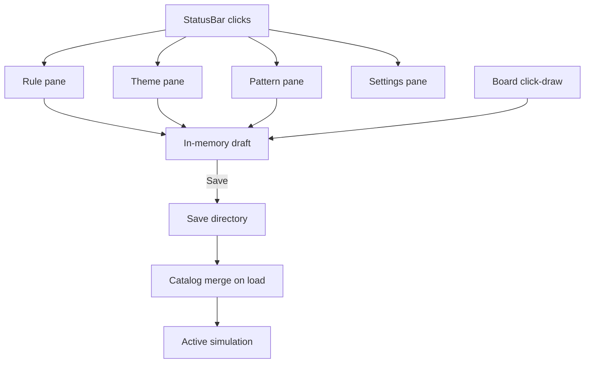
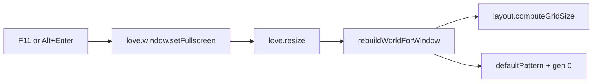

# Status bar & panes (UI shell)

Covers the bottom status bar (display + controls) and the docked-pane system it opens: pane manager, session draft/apply framework, fullscreen toggle, and the Phase 2 rule/theme pickers. This is the "primary control surface" per the post-1.0 product direction.

See [`README.md`](README.md) for the cross-area roadmap. Related: [`03-playback.md`](03-playback.md) (state the Play/Pause/Step/Restart buttons control), [`05-persistence.md`](05-persistence.md) (Phase 3 adds Save/Delete to these panes), [`06-pattern-picker-and-drawing.md`](06-pattern-picker-and-drawing.md) and [`07-grid-settings.md`](07-grid-settings.md) (Phases 4–5 add more panes on this same framework), [`09-toolbar-and-drawing-tools.md`](09-toolbar-and-drawing-tools.md) (a *separate*, always-visible panel — not part of the docked-pane system described here).

## Development order

1. **M2-C** — status bar, display only (rulestring, size, theme, generation). ✓ shipped.
2. **M3-B** — status bar play/pause/step/restart controls + README. ✓ shipped.
3. **Phase 1** — pane manager, clickable chips, Settings button, fullscreen. ✓ shipped.
4. **Phase 2** — rule and theme pickers on the pane framework (Apply only, no persistence yet). ✓ shipped.
5. **Phase 3+** — Save/Delete UI on these same panes (see [`05-persistence.md`](05-persistence.md)).

---

### Milestone 2-C — Status bar (read-only) ✓
1. Add `stepInterval` to `src/config.lua` (default `0.15`; display only until M3)
2. Add `src/ui/statusbar.lua` — draw resolved rulestring, `rows×cols`, theme name, step interval
3. Wire `main.lua` `love.draw`: renderer above, status bar at bottom

**Checkpoint:** Bottom bar visible with live config values; board still centered above reserved area.

### Milestone 3-B — Status bar controls + docs ✓
1. Add play / pause / step buttons to `src/ui/statusbar.lua`
2. Wire mouse + keyboard shortcuts in `main.lua`
3. Update `README.md` — config keys, patterns, controls, rulestring presets

**Checkpoint:** Full playable app; README matches behavior.

---

## Post-1.0 vision

Turn the status bar from a read-only stats row into the **primary control surface**: clickable labels open docked panes; a master **Settings** button covers grid/display options. Users can pick built-ins, edit drafts in memory, and **Save** custom patterns, rules, and themes to a shareable userspace folder (see [`05-persistence.md`](05-persistence.md)).

**Fullscreen** (F11 / Alt+Enter) is folded into Phase 1 alongside the UI shell — keyboard-only, no status bar button.



### Status bar UX (target layout)

**Left (clickable stat chips):**

| Chip | Opens |
|------|--------|
| `Rule: B3/S23` | Rule pane — preset list + custom `Bx/Sy` field + Apply / Save |
| `Theme: solarized` | Theme pane — preset list + hex fields + live swatches + Apply / Save |
| `Pattern: glider` | Pattern pane — catalog list + New / Edit / Save (Phase 4, see [`06-pattern-picker-and-drawing.md`](06-pattern-picker-and-drawing.md)) |
| `Size: 40x60` | Settings pane — grid section (Phase 5, see [`07-grid-settings.md`](07-grid-settings.md)) |
| `Gen: N` | Read-only (no pane) |

**Right:** existing Play / Pause / Step / Restart (see [`03-playback.md`](03-playback.md)) + Settings button (grid, tile size, auto-fit toggle, fullscreen hint).

**Pane behavior:**
- Docked above the opener chip or button (left edges align; right-align on overflow).
- Full-window dim except the pane and active opener, which stay bright.
- One pane open at a time; clicking the same chip or `Esc` closes it.
- Theme-driven colors; reuse `src/ui/statusbar.lua` color helpers.

### Draft vs saved state

Session object in `src/session.lua`:

| Field | Purpose |
|-------|---------|
| `draftRule` | Unsaved custom rulestring / preset selection |
| `draftTheme` | Unsaved color edits |
| `draftPattern` | Cells drawn or edited, not yet saved (Phase 4) |
| `gridMode` | `"auto"` (default) or `"forced"` (Phase 5) |
| `forcedTileSize`, `forcedRows`, `forcedCols` | Only used when `gridMode == "forced"` (Phase 5) |

- **Apply** — use draft in simulation immediately. **Per-pane playback policy** (preserve running sim when possible):

| Pane | On Apply |
|------|----------|
| Theme | Live color swap; **playback continues** |
| Rule | **Pause**; cancel in-flight step animation; swap rule; `grid.computeNext` (board cells preserved) |
| Pattern (Phase 4) | **Pause**; reload pattern onto board; reset generation |
| Grid settings (Phase 5) | **Pause**; rebuild grid; reload active pattern |

Opening a pane never pauses playback. Panes block playback **keyboard** shortcuts only — not the `love.update` timer (see [`03-playback.md`](03-playback.md)).
- **Save** — write to userspace; assign stable `id` (slug from name). See [`05-persistence.md`](05-persistence.md).
- **Discard** — revert draft to last applied/saved state.

Board drawing writes to `draftPattern` / live `world.current` while paused (never while playing) — mechanism detailed in [`06-pattern-picker-and-drawing.md`](06-pattern-picker-and-drawing.md), superseded by the Phase 7 Draw tool ([`09-toolbar-and-drawing-tools.md`](09-toolbar-and-drawing-tools.md)).

### Input and interaction rules

- Panes capture mouse/keyboard while open (typing in rule field must not trigger play shortcuts). **Do not** auto-pause playback when a pane opens.
- `Esc` closes top pane.
- Drawing/editing requires **paused** playback.
- Resize restart policy:
  - **Auto mode:** keep current restart-on-resize behavior.
  - **Forced mode:** resize only recenters; changing grid fields restarts from active pattern/draft.

---

## Phase 1 — UI shell + fullscreen ✓

**Delivers:** pane framework, clickable status bar regions, Settings button, fullscreen keys.

| File | Role |
|------|------|
| `src/ui/pane.lua` | Pane manager: open/close/toggle, draw, hit-test, height |
| `src/ui/statusbar.lua` | Clickable stat chips; Settings button |
| `src/session.lua` | Draft/applied state scaffold for Phases 2–5 |
| `main.lua` | Input routing; `Esc` closes pane |
| `src/renderer.lua` | Board layout unchanged when pane open |
| `tests/pane_spec.lua` | Pane open/close/toggle and hit-test |

### Fullscreen toggle

Keyboard-only fullscreen toggle:
- **F11** — toggle on/off
- **Alt+Enter** — toggle on/off (check `return` key with Alt held)

No status bar UI button (Settings pane may show a hint).



Toggle helper in `main.lua`:

```lua
local function toggleFullscreen()
  local fullscreen, fstype = love.window.getFullscreen()
  love.window.setFullscreen(not fullscreen, fstype or "desktop")
end
```

Use `"desktop"` fullscreen mode (borderless desktop resolution; works well with resizable/auto-fit grid).

**Tradeoff (unchanged):** toggling fullscreen restarts the simulation, same as manual window resize. On macOS, Option+Return may not map to Alt+Enter; F11 remains the primary cross-platform shortcut.

No `conf.lua` change required — `resizable = true` already set.

**Checkpoint:** ✓ Docked pane + dim spotlight on opener; chips/Settings/×/`Esc` open and close; playback keys blocked while open.

---

## Phase 2 — Runtime rule and theme pickers ✓

**Delivers:** click Rule / Theme chips → working panes with built-in lists.

| File | Work |
|------|------|
| `src/ui/panes/rule_pane.lua` | Preset buttons, `Bx/Sy` text input, Apply ✓ |
| `src/ui/panes/theme_pane.lua` | Preset buttons, hex fields + live swatches, Apply ✓ |
| `src/ui/pane_widgets.lua` | Shared button/field/swatch draw + `layoutGrid` ✓ |
| `main.lua` | Swap `activeRule` / `theme` on Apply; `grid.computeNext` ✓ |

**Checkpoint:** switch conway ↔ ant_colony and themes (see [`01-simulation-and-patterns.md`](01-simulation-and-patterns.md), [`02-rendering-and-animation.md`](02-rendering-and-animation.md)) without editing config file. ✓

**Post-checkpoint fixes (after theme catalog grew to 21 presets):**
- Theme pane's editable fields initially omitted `accent` — added as a 5th (optional) field; blank clears accent on Apply.
- Preset buttons in a single row overflowed with 21 themes — `pane_widgets.layoutGrid` wraps preset rows at a bounded width.
- Side-by-side label/field rows had vertical misalignment — labels now center on the input row.
- **Draft color preview:** swatch column beside each hex field updates live on preset click or valid hex entry (no Apply needed); `themes.colorFromHex` parses draft values for swatch fill.
- Regression coverage in `tests/phase2_spec.lua` and `tests/themes_spec.lua`.

**Watch for (Phase 3):** `rule_pane.lua` still lays out preset buttons in a single unwrapped row (fine for 2 built-ins). If user-saved rules grow the catalog, switch it to `pane_widgets.layoutGrid` the same way `theme_pane.lua` does.

## Design decisions (locked)

### Status bar (bottom)
- Fixed-height bar at **bottom** of window (`statusBarHeight` in config, not in theme).
- Board renders in remaining viewport above the bar (still centered horizontally).
- **Milestone 2-C** (display only): show
  - resolved rulestring (e.g. `B3/S23`)
  - board size (`rows×cols`)
  - active theme name
  - generation counter (`Gen: N`) — replaced planned step-interval display
- **Milestone 3-B** (interactive): add controls
  - Play / Pause
  - Step forward (advance one generation)
  - Restart (reload `defaultPattern`, reset generation)
- **Post-M3:** fast mode (`f` hold) changes Play label to `Play +` and step interval to `0.05` — see [`03-playback.md`](03-playback.md)
- Text/button hit areas in `src/ui/statusbar.lua`; input wired in `main.lua`.

## Open design considerations
- Status bar text scaling: long strings can clip on small windows; decide whether to truncate, reduce font size, or wrap.
- **LÖVE 12 (when released):** revisit `Font:setBold()` for pane titles (11.x uses larger font only). Also affects CI/release — see [`11-testing-and-ci.md`](11-testing-and-ci.md).

## Config keys (this area)

| Key | Default | Phase |
|-----|---------|-------|
| `statusBarHeight` | `28` | M1 ✓ |
| `paneWidth` | — | Phase 1 ✓ |
| `paneHeight` | — | Phase 1 ✓ |
| `paneBackdropAlpha` | — | Phase 1 ✓ |

## Planned/existing files

| File | Status | Phase |
|------|--------|-------|
| `src/ui/statusbar.lua` | exists | M2-C ✓ display; M3-B ✓ controls; Phase 1+ ✓ clickable chips |
| `src/ui/pane.lua` | exists | Phase 1 ✓ |
| `src/session.lua` | exists | Phase 1 ✓ draft/applied scaffold; Phase 7 adds `activeTool` (see [`09-toolbar-and-drawing-tools.md`](09-toolbar-and-drawing-tools.md)) |
| `src/ui/panes/rule_pane.lua` | exists | Phase 2 ✓ |
| `src/ui/panes/theme_pane.lua` | exists | Phase 2 ✓ |
| `src/ui/pane_widgets.lua` | exists | Phase 2 ✓ |
| `tests/statusbar_spec.lua` | exists | Post-M3 ✓ layout/hit-test; Phase 1+ pane hit regions |
| `tests/pane_spec.lua` | exists | Phase 1 ✓ |
| `tests/phase2_spec.lua` | exists | Phase 2 ✓ |
| `tests/themes_spec.lua` | exists | Phase 2 ✓ |

## TODO tracking

### Milestone 2-C — Status bar (read-only) ✓
- [x] Add `stepInterval` to `src/config.lua`
- [x] Add `src/ui/statusbar.lua` (display-only stats row)
- [x] Wire status bar in `main.lua` `love.draw`

### Milestone 3-B — Controls + docs ✓
- [x] Status bar play/pause/step buttons and keyboard shortcuts
- [x] Update `README.md` (config, patterns, controls, rulestrings)

### Phase 1 ✓
- [x] **Phase 1** — UI shell (pane manager, clickable chips, Settings button; fullscreen keys done in 1a)

### Phase 2 ✓
- [x] **Phase 2** — Rule and theme pickers (docked panes, built-in Apply)

### Superseded by later phases (mark complete when phase ships)
- [ ] Add click-to-toggle cell state → Phase 4 (see [`06-pattern-picker-and-drawing.md`](06-pattern-picker-and-drawing.md))
- [ ] Pattern picker UI (cycle/load catalog entries at runtime) → Phase 4
- [x] Add runtime rule switching (keyboard/UI picker) → Phases 2–3
- [x] Add runtime theme switching (keyboard/UI picker) → Phases 2–3
- [ ] Add more built-in rule presets beyond `conway`, `ant_colony` → Phase 3 userspace
