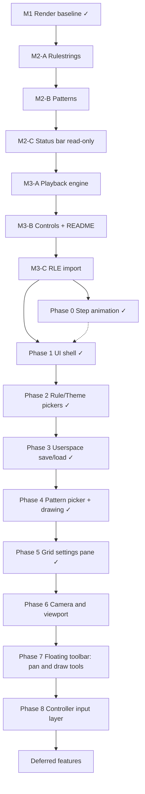

# Plan Directory

This directory is the implementation plan for `love-life`, split by application area so no single document gets unwieldy. It replaces the old top-level `PLAN.md` (history preserved via git). For active handoff state (current branch, what shipped last, what's next), see [`../AGENTS.md`](../AGENTS.md) — that file is the day-to-day status doc; this directory is the durable design/roadmap reference.

## Goal

Create a playable Conway's Game of Life in LÖVE: configurable toroidal grid, theme-driven rendering with next-generation preview markers, loadable initial patterns, configurable rulestrings, bottom status bar, and play/pause/step controls. Post-1.0 work extends this into a fuller sandbox: pickers, userspace save/load, board drawing, a camera, and controller input.

## Plan status

- **Branch:** `main`
- **Version:** v1.4.0 ready to tag; Phase 5 ✓
- **Done:** M1–M3, post-M3 polish, release CI, 1a fullscreen, Phase 0, Phase 1 (UI shell), Phase 2 (rule/theme pickers), Phase 3 (userspace save/load), Phase 4 (pattern picker + board drawing), Phase 5 (grid settings)
- **Next:** Phase 6 camera/viewport (backlog, may be resequenced)
- **Backlog (not started, not sequenced):** Phase 6 (camera/viewport), Phase 7 (floating toolbar: pan/draw/zoom), Phase 8 (controller input layer), reusable button transition fx

## Directory map

| Doc | Area | Covers |
|-----|------|--------|
| [`01-simulation-and-patterns.md`](01-simulation-and-patterns.md) | Simulation engine | M1, M2-A (rules), M2-B (patterns), M3-C (RLE import), pattern file format, catalog tiers |
| [`02-rendering-and-animation.md`](02-rendering-and-animation.md) | Rendering & themes | Renderer, theme registry, Phase 0 step animation, reusable button fx |
| [`03-playback.md`](03-playback.md) | Playback engine | M3-A playback state machine, fast mode/restart, deferred history stack |
| [`04-ui-shell-and-panes.md`](04-ui-shell-and-panes.md) | Status bar & panes | M2-C display, M3-B controls, Phase 1 UI shell + fullscreen, Phase 2 rule/theme pickers, post-1.0 pane/draft framework |
| [`05-persistence.md`](05-persistence.md) | Userspace save/load | Phase 3 — `src/userdata.lua`, merged catalogs |
| [`06-pattern-picker-and-drawing.md`](06-pattern-picker-and-drawing.md) | Pattern picker + drawing | Phase 4 — pattern pane, board drawing, deferred catalog grouping |
| [`07-grid-settings.md`](07-grid-settings.md) | Grid settings | Phase 5 — auto vs forced grid mode, letterboxing |
| [`08-camera-and-viewport.md`](08-camera-and-viewport.md) | Camera & viewport | Phase 6 (backlog) — pan/zoom, world ≠ visible area |
| [`09-toolbar-and-drawing-tools.md`](09-toolbar-and-drawing-tools.md) | Floating toolbar | Phase 7 (backlog) — pan/draw tools, zoom +/− |
| [`10-controller-input.md`](10-controller-input.md) | Controller input | Phase 8 (backlog) — unified mouse/keyboard/gamepad action layer |
| [`11-testing-and-ci.md`](11-testing-and-ci.md) | Testing & CI | Testing strategy, GitHub Actions (test + release), validation checklists |
| [`12-deferred-and-backlog.md`](12-deferred-and-backlog.md) | Deferred & backlog | Explicitly deferred items, superseded history, adjacent ideas not yet scoped |

Each doc contains its own **Development order** section for the steps within it. This README's execution order below is the cross-area sequence.

## Roadmap

| Milestone | Phases | Delivers |
|-----------|--------|----------|
| **M1** ✓ | — | Grid render, themes, preview dots, toroidal stepping foundation |
| **M2** | A → B → C | Configurable rules, pattern loader, status bar stats display |
| **M3** | A → B → C | Playback engine, controls/docs, RLE import |
| **Post-1.0** | 0 → 5 | Step animation, settings UI shell, pickers, userspace, board drawing, grid modes |
| **Backlog** | 6 → 8 | Camera/viewport (pan/zoom), always-visible floating toolbar (pan/draw tools, zoom controls), controller input layer (mouse/keyboard/gamepad) |
| **Deferred** | — | History stack, RLE export, import UI, video export |

## Execution order (all areas)

Phases are intentionally small. Finish each phase before starting the next.

**Sequencing note (backlog, not decided):** Phases 6–8 are captured for planning but not yet scheduled. Camera work (Phase 6, see [`08-camera-and-viewport.md`](08-camera-and-viewport.md)) touches the same coordinate math as Phase 4b board drawing ([`06-pattern-picker-and-drawing.md`](06-pattern-picker-and-drawing.md)) and Phase 5 forced grid/letterbox ([`07-grid-settings.md`](07-grid-settings.md)) — it may make sense to pull Phase 6 earlier to avoid rework, but that reordering is **not decided here**; revisit when picking up Phase 4 or 5.

### Recommended implementation order (post-1.0)

Phase 0 ✓ and 1a fullscreen ✓ are complete on `main`. Phases 1–5 ✓. **Backlog next:** Phase 6 (camera) unless resequenced.

| Step | Phase | Rationale |
|------|-------|-----------|
| 1 | **1a — Fullscreen** ✓ | F11 / Alt+Enter; shipped on `main` |
| 2 | **0 — Step animation** ✓ | Square preview→commit, idle markers, 3D tiles; PR #1 |
| 3 | **1 — UI shell + `session.lua`** ✓ | Pane framework, clickable chips; placeholder panes |
| 4 | **2 — Rule + theme pickers** ✓ | Rule Apply + theme auto-apply; validates pane UX without disk I/O |
| 5 | **3a — `userdata.lua`** ✓ | Persistence API + catalog merge + unit tests |
| 6 | **3b — Save UI** ✓ | Save / Delete on rule + theme panes |
| 7 | **4a — Pattern picker** ✓ | Catalog list + Apply |
| 8 | **4b — Board drawing** ✓ | Paused left/right drag drawing; superseded in mechanism by Phase 7 Draw tool once that lands |
| 9 | **5 — Grid settings** ✓ | Auto vs forced letterbox; auto resize refits, forced recenters only |
| 10 | **6 — Camera & viewport** (backlog) | See sequencing note above — may move earlier — **next candidate** |
| 11 | **7 — Floating toolbar** (backlog) | Depends on Phase 6 coordinate transforms |
| 12 | **8 — Controller input** (backlog) | Deliberately separate from mouse/keyboard UI work |

**Suggested release slices:**

| Release | Contents |
|---------|----------|
| v1.1 | Fullscreen (1a) + Phase 0 animation (square preview→commit, 3D tiles) — shipped |
| v1.2 | Phase 1 shell + Phase 2 pickers (rule Apply; theme auto-apply) — shipped |
| v1.3 | Phase 3 persistence + HSV color picker + Phase 4 pattern picker + board drawing — shipped |
| v1.4 | Phase 5 grid settings — ready to tag |

## Entry point files

`main.lua` (LÖVE lifecycle: `love.load`/`update`/`draw`/input callbacks) and `conf.lua` (window config) are composition roots touched by nearly every area — each area doc's file table calls out its specific `main.lua` hook. No standalone design doc for them; see the area doc for the phase you're implementing.

## Cross-area open considerations

Most open design questions are area-specific and live inline in the relevant doc (e.g. camera/letterbox overlap in [`08-camera-and-viewport.md`](08-camera-and-viewport.md), toolbar icon strategy in [`09-toolbar-and-drawing-tools.md`](09-toolbar-and-drawing-tools.md)). Genuinely cross-area items:

- **Phase 6–8 sequencing** relative to Phases 3–5 — see sequencing note above.
- **LÖVE 12 (when released):** revisit `Font:setBold()` for pane titles (see [`04-ui-shell-and-panes.md`](04-ui-shell-and-panes.md)); evaluate CI/release Lua-and-LÖVE version bump (see [`11-testing-and-ci.md`](11-testing-and-ci.md)).

## Working agreement

- Keep [`../AGENTS.md`](../AGENTS.md) updated with active context, constraints, and decisions.
- Keep this `plan/` directory updated as implementation progresses.
- Preserve historical intent by marking items complete rather than deleting sections (each area doc keeps its own TODO/checklist history).
